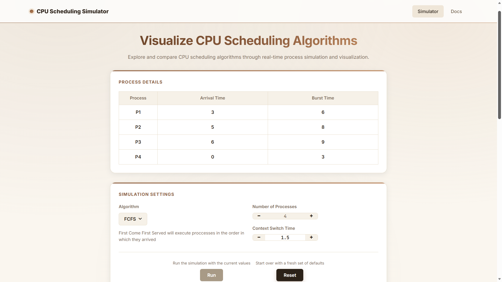
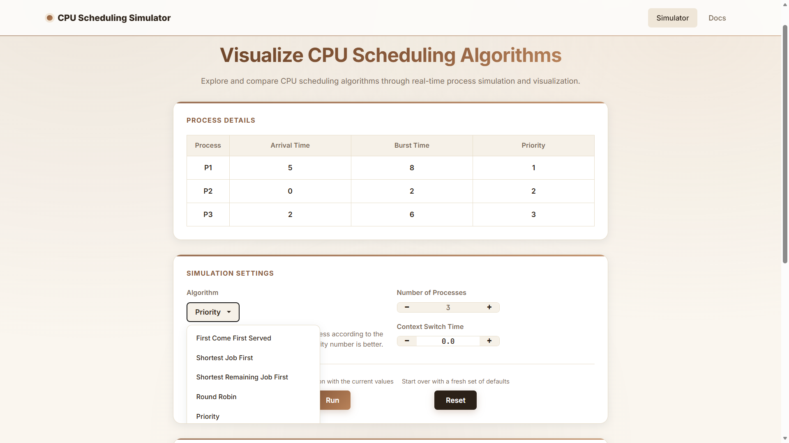
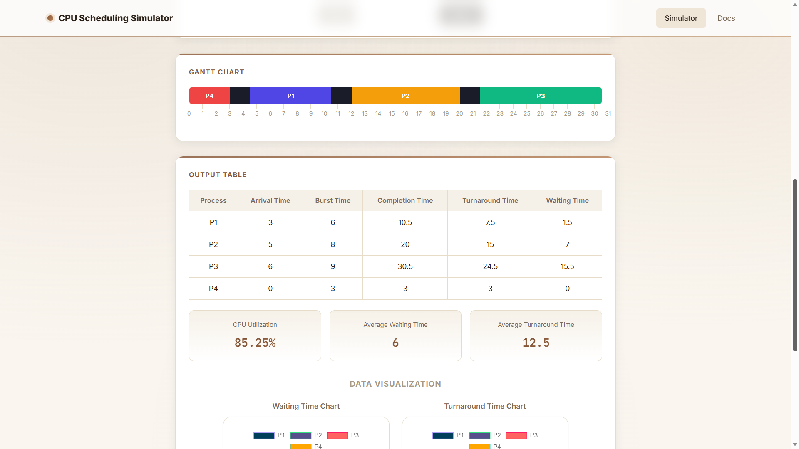
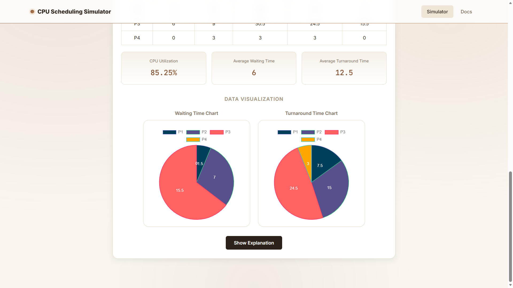
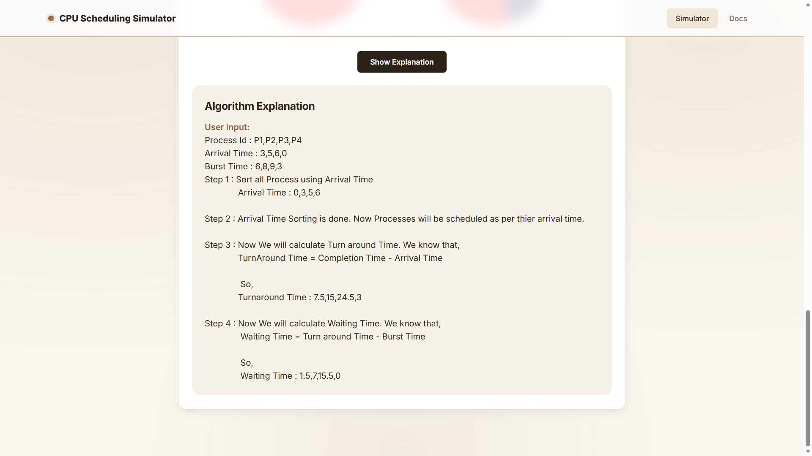
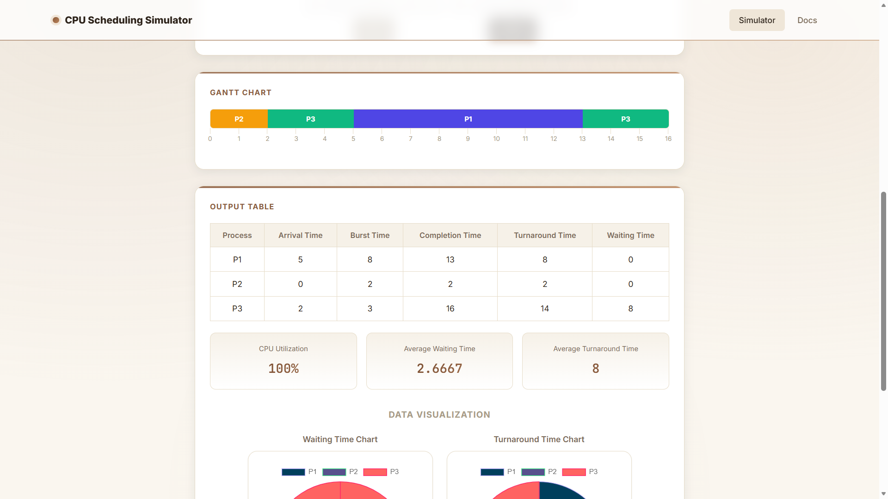
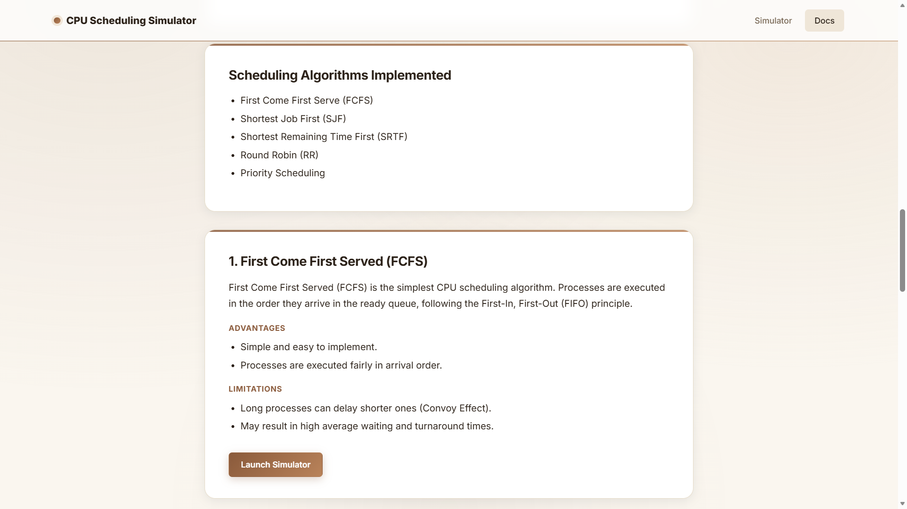

# 🖥️ CPU Scheduling Simulator

An interactive web-based CPU Scheduling Simulator that visualizes how different CPU scheduling algorithms execute processes. The simulator enables users to configure process details, compare scheduling strategies, and analyze performance metrics through dynamic visualizations such as Gantt Charts, statistical summaries, and charts update in real time.


## ✨ Features

-  Supports five CPU scheduling algorithms:
  - First Come First Served (FCFS)
  - Shortest Job First (SJF)
  - Shortest Remaining Time First (SRTF)
  - Round Robin (RR)
  - Priority Scheduling

-  Configure:
  - Number of processes
  - Arrival time
  - Burst time
  - Priority
  - Context switch time
  - Time quantum (Round Robin)

-  Interactive Gantt Chart visualization

-  Performance Metrics
  - CPU Utilization
  - Average Waiting Time
  - Average Turnaround Time

-  Detailed Output Table
  - Completion Time
  - Waiting Time
  - Turnaround Time

-  Data Visualization Charts
  - Waiting Time Chart
  - Turnaround Time Chart

-  Built-in Documentation Page explaining:
  - CPU Scheduling
  - Scheduling Algorithms
  - Advantages & Limitations
  - Scheduling Concepts

-  Step-by-step execution explanation for each algorithm

-  Responsive and modern UI with improved user experience


## 🚀 Technologies Used

| Technology | Purpose |
|------------|----------|
| HTML5 | Structure |
| CSS3 | Styling & Responsive UI |
| JavaScript (ES6) | Scheduling Logic |
| jQuery | DOM Manipulation |
| Bootstrap | Components & Layout |
| Chart.js | Performance Charts |
| Font Awesome | Icons |
| MathJax | Mathematical Formula Rendering |


# 📸 Screenshots

## Home & Process Input



## Choosing an Algorithm



## Gantt Chart & Output Table



## Data Visualization



## Step-by-Step Explanation



## Priority Scheduling in Action



## Documentation




# 📂 Project Structure

```text
CPU-Scheduling-Simulator/
│
├── css/
│   ├── style.css
│   ├── simulator.css
│   └── docs.css
│
├── js/
│   ├── scheduler.js
│   ├── ui.js
│   └── mathjax-config.js
│
├── screenshots/
│   ├── algorithm-dropdown.png
│   ├── charts.png
│   ├── docs.png
│   ├── explanation.png
│   ├── gantt-output.png
│   ├── home-input.png
│   └── priority-example.png
│
├── docs.html
├── index.html
├── README.md
├── LICENSE
└── .gitignore
```


# ▶️ Running Locally

## Clone the repository

```bash
git clone https://github.com/kiranchand02/CPU-Scheduling-Simulator.git
```

```bash
cd CPU-Scheduling-Simulator
```

## Run the project

Simply open **index.html** in your browser.

Or serve locally:

```bash
python -m http.server 8000
```

Then visit:

```
http://localhost:8000
```


# 👨‍💻 My Contributions

Although this project was developed as an academic group project, my primary contributions include:

- Designing and developing the user interface.
- Implementing the Round Robin scheduling algorithm.
- Implementing the Priority Scheduling algorithm.
- Creating the project documentation.
- Testing and debugging the application.


# 📄 License

This project is licensed under the MIT License - see the [LICENSE](LICENSE) file for details.

> **Note:** This project was developed for academic/educational purposes as part of my coursework.